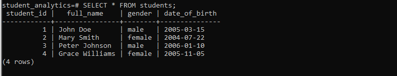
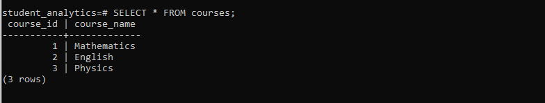
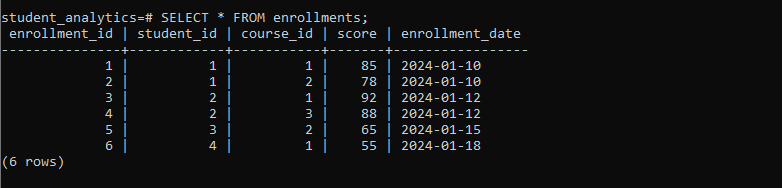

# Student Records Analytics – A Beginner’s SQL Journey (SQL Project)

## 📝 My Story

As a data analyst, I always wanted to **practice building a complete SQL project from scratch**—something I could both learn from and show in my portfolio.  
I chose to simulate a **student records system**, because it’s simple enough to understand but rich enough to cover real-world SQL concepts like joins, aggregations, and case statements.  

I decided to start this project as a personal learning exercise in PostgreSQL, using only the terminal. Along the way, I structured my work-flow just like a professional analyst would have done it:
Started by having **database creation**, **tables**, **data inserts**, and **analysis queries** into clean, reusable scripts.

By the end, I had a **fully working database** and a set of queries that could answer meaningful questions about students, courses, and performance.

---

## 🛠 Tools I Used

- **PostgreSQL** – for building and querying the database  
- **psql (Command Line)** – to run all SQL commands  
- **Git** – to version-control the project  
- **Command Prompt / VS Code** – for editing and file management  

---

## 📚 What You’ll Find in This Project

This project is organized to make it **easy to follow**:


- **01_create_database.sql** – creates the `student_analytics` database  
- **02_create_tables.sql** – sets up tables: `students`, `courses`, `enrollments`  
- **03_insert_data.sql** – inserts sample data for testing and analysis  
- **04_analysis_queries.sql** – contains all my queries, from simple filters to joins and case statements  

---

## 🔍 What I Learned

Working on this project helped me understand **SQL from an analyst perspective**:

1. How to **structure a database** for analytical queries  
2. How to **filter, sort, and aggregate data** to answer meaningful questions  
3. How to use **joins and case statements** to combine data and perform conditional analysis  
4. How to **document and version-control** my work for sharing or portfolio purposes  
5. The importance of **storytelling in data** — not just writing queries, but understanding what each query answers  

---

## 🎯 Example Questions Answered

- Which students are female?  
- Average score per course  
- Which students passed or failed based on a 70-point threshold  
- Who is the top-performing student?  
- Monthly enrollment trends  

Each of these queries is **self-contained** in `04_analysis_queries.sql` and can be executed in order.

---

### Sample Query Outputs

**Students Table**


**Courses Table**


**Enrollments Table**


## ▶️ How to Run This Project

1. Ensure PostgreSQL server is running on your machine  
2. Open Command Prompt or terminal  
3. Connect to PostgreSQL using:

```bat
psql -h 127.0.0.1 -U postgres


## 🗃 Database Schema
- students
- courses
- enrollments

---

## 📊 Key Analysis Performed
- Filtered students by gender
- Average scores per course
- Pass/Fail classification using CASE
- Identification of top-performing student
- Monthly enrollment analysis

---

### 👤 Author

Michael Martins

Passionate about learning and teaching data analysis, especially SQL, Excel, and Power BI.
This project is part of my journey to build a portfolio that shows real-world analytical thinking, not just technical skills.
